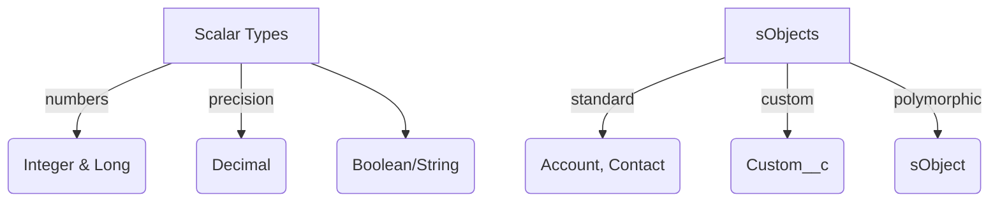

# Apex Data Types
Build reliable solutions by understanding how Apex stores and validates data. This module moves from primitive types to rich `sObject` records so analysts and admins can reason about strongly typed logic before writing collections or OOP-heavy code.

## Scalar and System Types
Salesforce provides Java-like primitives plus platform-specific types (`Id`, `Decimal`, `Date`, `Datetime`, `Time`). Use the smallest type that expresses intent and keeps governor usage low.

```apex
public class TypePlayground {
    public static void demo() {
        Integer invoiceCount = 12;
        Decimal totalAmount = 1250.45;
        Boolean needsFollowUp = totalAmount > 1000;
        Date closeDate = Date.today().addDays(30);
        Id exampleId = '001000000000001AAA';

        System.debug(String.format('Invoices: {0} | Total: {1,number,#.00}', new List<Object>{ invoiceCount, totalAmount }));
        System.debug('Follow-up? ' + needsFollowUp);
        System.debug('Close Date: ' + closeDate);        
    }
}
```

### Casting and Precision
- Implicit casts only occur when no data loss happens (e.g., `Integer` → `Long`).
- Call helper methods like `Decimal.valueOf('19.95')` for safe parsing.
- Guard `Decimal` arithmetic with `setScale()` when currency precision matters.

## Date and Time Awareness
Store date-only fields as `Date` and any clock-specific value as `Datetime` or `Time`. Apex automatically localizes values when they are rendered in the UI, but calculations (like SLA expirations) must use UTC math to avoid daylight savings bugs.

```apex
Datetime eta = System.now().addMinutes(90);
Integer minutesLeft = eta.getTime() - System.now().getTime();
```

## sObjects vs Generic `sObject`
`sObject` behaves like a dynamic interface for records when you do not know the type at compile time. Prefer concrete types (`Account`, `Opportunity`) for compile-time safety, but leverage `sObject` when iterating through describe metadata or handling polymorphic lookups.

```apex
public class RecordFactory {
    public static Account buildAccount(String name, Decimal annualRevenue){
        return new Account(Name = name, AnnualRevenue = annualRevenue);
    }

    public static sObject cloneToType(String apiName, Id sourceId){
        sObject record = Database.query('SELECT Id FROM ' + apiName + ' WHERE Id = :sourceId');
        return record.clone(false, false, false, false);
    }
}
```

## Type Relationships (Mermaid Overview)


## Exercise: Data Validation Utility
Create an `InputValidator` class that accepts a `Map<String, Object>` of user-provided values and returns a typed DTO (for example, `LeadCaptureRequest`). The class should:
1. Attempt to coerce `String` inputs into the expected scalar types using `valueOf` methods.
2. Validate mandatory fields (name, email, target close date) and collect any failures into a `List<String>`.
3. Return both the DTO and errors so a Flow or LWC can branch on the result.

Deliverable: runnable class plus a short anonymous Apex script proving that valid payloads produce a populated DTO and invalid payloads capture errors.
