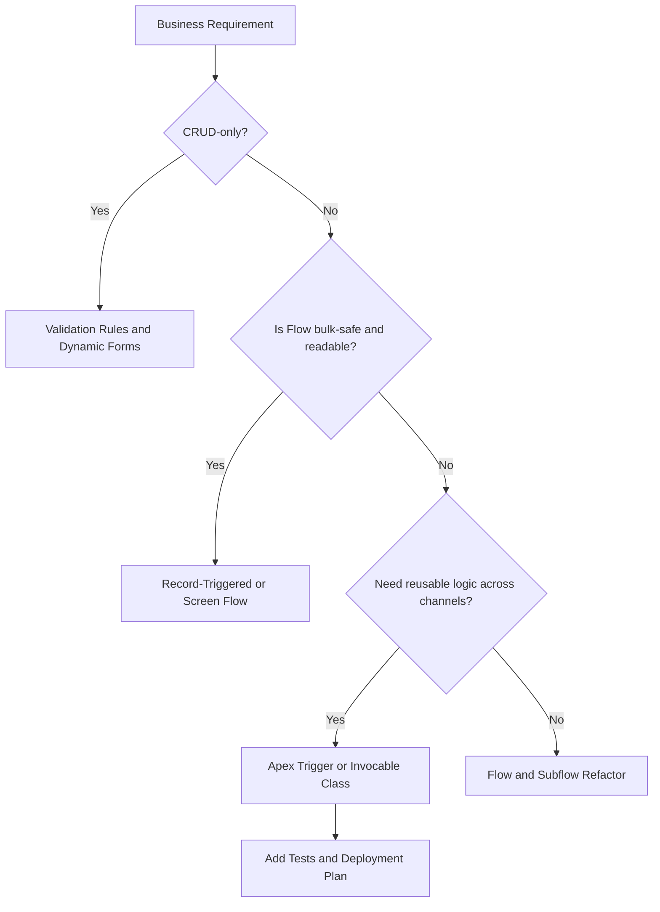

# Declarative vs Programmatic Tools
Understand how to match Salesforce requirements to the right level of automation before writing or requesting Apex. Analysts who recognize when declarative tools are enough keep the org maintainable and reserve developer capacity for the work that truly needs code.

## Core Principles
- **Start declarative by default.** Flow, Approval Processes, and dynamic forms are faster to ship and easier for admins to own post-launch.
- **Escalate when logic becomes unreadable.** If your Flow looks like spaghetti or needs workarounds (loops inside loops, excessive invocable calls), the requirement is signaling for Apex.
- **Model operational risk.** Apex trades faster runtime and reusability for deploy-time rigor (tests, code review, release windows). Document the stakeholder appetite for each.

## Automation Spectrum (Mermaid Overview)



## Strengths at a Glance
| Scenario | Declarative Tools Shine When | Apex Becomes Necessary When |
| --- | --- | --- |
| **Simple field updates** | Limited objects, no branching, predictable order | Multiple objects require coordinated DML with error recovery |
| **User-guided intake** | Screen Flows provide input validation and conditional visibility | Intake must call external APIs, cache responses, or share logic with a partner portal |
| **Record-triggered automation** | Volume low-to-medium (<2k records/tx), operations single-object | Transactions hit bulk limits, require complex SOQL joins, or must de-duplicate data inside a set |
| **Approval or compliance steps** | Standard approval chains and escalations work | Approvals vary by product hierarchy or require dynamic routing stored in custom metadata |

## Evaluation Checklist
1. **Volume & Limits:** Estimate worst-case records per transaction. If the number crosses 200 or touches nightly integrations, Apex provides deterministic bulk handling.
2. **Data Shape:** Count how many objects and relationships must be updated together. Cross-object DML plus recursion control typically favors Apex services.
3. **Reusability:** Will this logic run from Flow today and a REST API tomorrow? Use Apex classes with clearly named methods (`OpportunityDiscountService.apply`) and expose them via invocable actions.
4. **Auditability:** Explain who will own future changes. If business users need to tweak logic weekly, stay declarative as long as performance allows.
5. **Risk Profile:** Document governor-limit-sensitive operations (nested loops, multiple SOQL queries). If you can’t articulate how the automation avoids limits, consult developers sooner.

## Communicating with Developers
- **Provide acceptance criteria per entry context.** Example: “Trigger must process 500 Billing__c updates from integration within one transaction, skipping records that violate credit rules.”
- **Share interim Flow logic.** Developers can translate Flow screens/decisions into Apex classes faster when they see the current shapes.
- **Flag integration partners.** Callouts and platform events have different limits; knowing them upfront prevents refactors mid-sprint.
- **Align on test data.** Suggest concrete sample records and edge cases so developers can encode them in `@IsTest` classes you can read later.

## Reading Apex for Admins
```apex
public without sharing class DiscountEvaluator {
    public static Decimal applyTieredDiscount(Quote__c quoteRecord) {
        Map<Integer, Decimal> tiers = new Map<Integer, Decimal>{
            50000 => 0.10,
            100000 => 0.15
        };

        Decimal pct = 0;
        for (Integer threshold : tiers.keySet()) {
            if (quoteRecord.Annual_Value__c >= threshold) {
                pct = tiers.get(threshold);
            }
        }
        return quoteRecord.Annual_Value__c * pct;
    }
}
```
When reading Apex like this, focus on:
- **Inputs/outputs:** Method expects `Quote__c` and returns a `Decimal`. This hints that a Flow could call it with an invocable method wrapper.
- **Limit awareness:** No SOQL/DML, so the method is bulk-safe as long as callers run it inside loops carefully.
- **Reusability:** Logic centralized instead of duplicated across Flows.

## Exercise: Decision Log
Document two automation ideas from your org and score each against the checklist above. Produce:
- A recommendation (stay declarative, refactor Flow, or request Apex).
- The apex service(s) you would expect (`Trigger`, `Queueable`, `Invocable`).
- Risks to raise in sprint planning (limits, data skew, deployment timing).
Share the log with your developer counterpart to validate assumptions before committing to a build.
